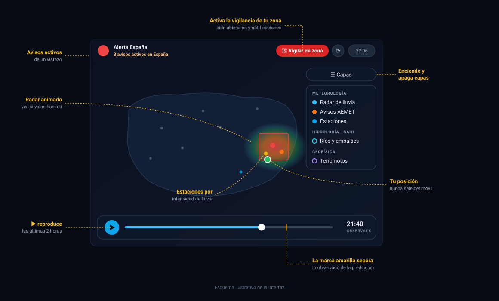
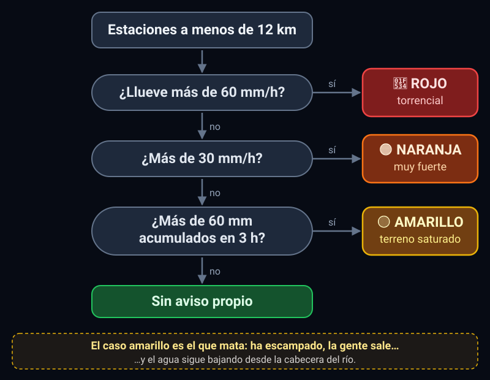
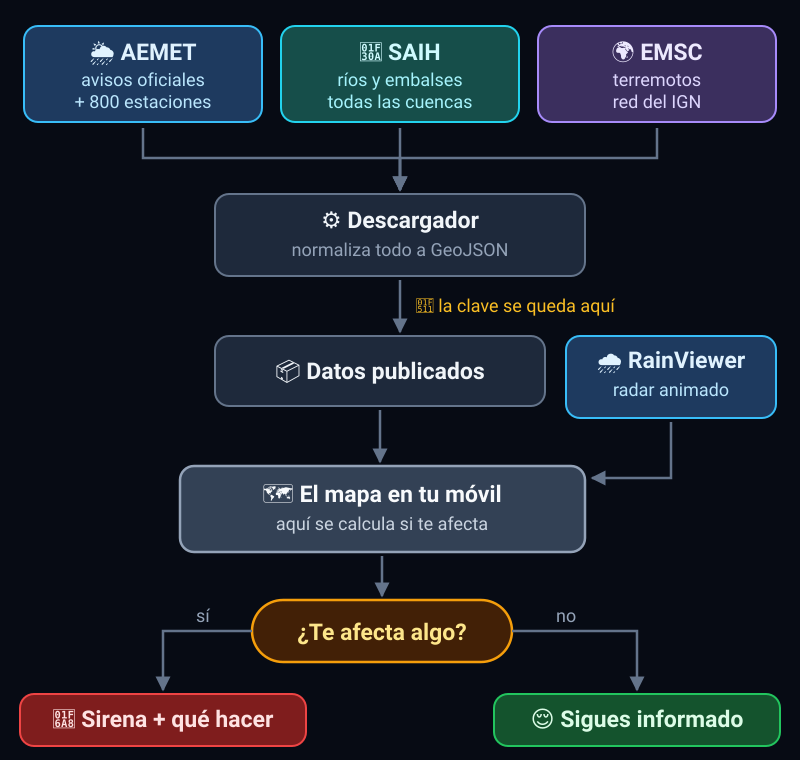
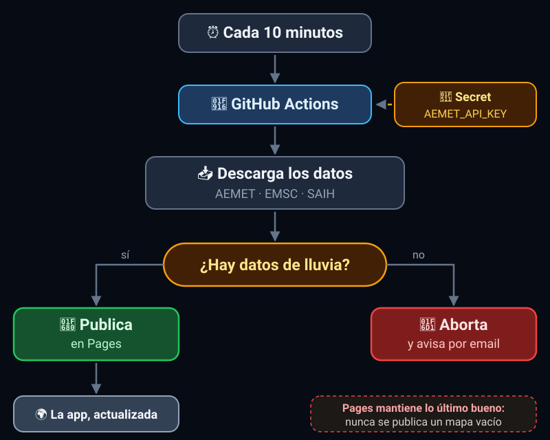

<p align="center">
  
</p>

<p align="center">
  <a href="https://shadowvmx.github.io/Spain-Alert/"></a>
</p>

<p align="center">
  
  
  
  <a href="CONTRIBUTING.md"></a>
</p>

---

## El problema

En España muere gente en riadas y DANAs que **habría podido ponerse a salvo si
hubiera sabido a tiempo lo que venía**. La información existe: AEMET, las
confederaciones hidrográficas y el IGN publican datos en tiempo real. El problema es
que están repartidos en portales distintos, con formatos distintos, y nadie los mira
mientras conduce de vuelta a casa bajo la lluvia.

**Alerta España junta todo eso en un mapa y te avisa cuando el peligro se acerca a
donde estás.**

> ⚠️ Esto no sustituye a Protección Civil ni al 112. Es una capa adicional, más
> rápida y más visual, para que nadie se quede sin enterarse.

---

## Cómo se usa

**Es una web. No hay que instalar nada, ni registrarse, ni configurar nada.**

### 👉 [shadowvmx.github.io/Spain-Alert](https://shadowvmx.github.io/Spain-Alert/)

<p align="center">
  
</p>

1. Abres el enlace. Ves España con el radar de lluvia en marcha.
2. **▶ abajo** reproduce la animación; el botón **1x/2x/4x** ajusta la velocidad. La
   marca amarilla separa lo ya observado de la predicción.
3. **☰ Capas** enciende y apaga radar, avisos, estaciones, embalses y terremotos.
4. **📍 Vigilar mi zona** activa el aviso automático (pide ubicación y notificaciones).
5. Tocas cualquier punto del mapa y ves su detalle.

**Para tenerla a mano en el móvil:** en el navegador, *"Añadir a pantalla de inicio"*.
Queda como una app más, con su icono.

**Tu ubicación nunca sale de tu dispositivo.** El cálculo de qué te afecta se hace en
tu propio móvil. No hay cuentas, ni registro, ni rastreo, ni publicidad.

---

## Qué muestra

| | |
|---|---|
| 🌧️ **Radar de lluvia animado** | Últimas 2 horas más predicción. **Ves si la tormenta viene hacia ti o se aleja** |
| ⚠️ **Avisos oficiales de AEMET** | Zonas de aviso por gravedad: amarillo, naranja, rojo |
| 📡 **858 estaciones** | Toda la red de AEMET, coloreada por intensidad de lluvia |
| 🌍 **Terremotos** | Sismos recientes de la red nacional |
| 💧 **Embalses** | Nivel de llenado por colores *(capa lista, pendiente de fuente de datos)* |

### Detección propia de riesgo de riada

Además de los avisos oficiales, la app calcula el suyo desde las estaciones cercanas:

<p align="center">
  
</p>

**El caso amarillo es el que mata.** La gente ve que ha escampado, se confía y sale
—mientras el agua sigue bajando desde la cabecera del río. Por eso avisamos aunque
en ese momento ya no llueva fuerte.

---

## Estado actual

### ✅ Funcionando en producción

| Capa | Fuente | Comprobado |
|---|---|---|
| Radar de lluvia | [RainViewer](https://www.rainviewer.com/) | Sí, en la app publicada |
| Estaciones | [AEMET OpenData](https://opendata.aemet.es) | Sí — **858 estaciones** por ejecución |
| Terremotos | [EMSC](https://www.seismicportal.eu) (incluye red del IGN) | Sí — **200 sismos** por ejecución |
| Mapa base | [CARTO](https://carto.com/attributions) + [OpenStreetMap](https://www.openstreetmap.org/copyright) | Sí |
| Alertas por proximidad | Cálculo local | Sí, en navegador con ubicación simulada |

### ⏳ Pendiente

| Qué | Estado real |
|---|---|
| **Avisos AEMET (CAP)** | El código está integrado y responde, pero desde que la app existe **no ha habido ningún aviso activo en España**, así que el parseo del formato oficial todavía no se ha visto funcionar con un aviso de verdad. |
| **Embalses** | La capa, los colores y la regla de aviso están hechos y probados. Falta la fuente: el API de objetos geográficos de MITECO responde, pero sus 30 colecciones son de agricultura, pesca y alimentación (quesos, vinos, batimetría). **El agua no está ahí.** Hay que localizar el servicio correcto. |
| **Ríos y caudales (SAIH)** | `wms.mapama.gob.es` responde con `UNABLE_TO_VERIFY_LEAF_SIGNATURE`: le falta el certificado intermedio en la cadena TLS. Los navegadores lo resuelven solos buscándolo; Node no. |
| **Notificaciones con la app cerrada** | Necesita un servidor con Push API y claves VAPID. Hoy el aviso solo salta con la pestaña abierta. |
| **Frecuencia real de actualización** | El cron pide cada 10 min, pero GitHub retrasa las tareas programadas: en la práctica se ejecuta cada 30-60 min. Para lluvia se aguanta; si esto se usa en serio, hay que mover la descarga a un servidor propio. |

---

## Cómo funciona por dentro

<p align="center">
  
</p>

GitHub Pages solo sirve archivos estáticos y no puede ejecutar un servidor. La
solución: **GitHub Actions hace de servidor por lotes**. Descarga los datos con la
clave de AEMET guardada como *secret*, los deja como archivos JSON y publica la web.

<p align="center">
  
</p>

La clave de AEMET **nunca llega al navegador**, y **las alertas se calculan en el
cliente** (`web/src/alertEngine.ts`), así que la ubicación del usuario no se envía a
ninguna parte.

```
server/                    Node + Express (TypeScript)
  src/lib/aemet.ts           avisos CAP + estaciones, con detección de clave caducada
  src/lib/embalses.ts        descubrimiento de embalses (a la espera de fuente)
  src/lib/saih.ts            capas WMS de ríos y embalses
  src/lib/earthquakes.ts     sismos vía EMSC
  src/lib/rain.ts            escala oficial de intensidad de AEMET
  src/scripts/               generador de datos estáticos

web/                       Vite + React + Leaflet
  src/alertEngine.ts         ⭐ cálculo de alertas EN EL NAVEGADOR
  src/components/            mapa, radar, panel, avisos, embalses
  src/hooks/                 datos, geolocalización, frames del radar

.github/workflows/         descarga datos y publica en Pages
```

### Cómo falla (a propósito)

En una app de avisos, **unos datos viejos son más peligrosos que no tener datos**: un
mapa en calma hace creer que no hay peligro. Por eso:

| Situación | Qué hace |
|---|---|
| Falla una fuente secundaria (sismos, embalses) | Publica igual: mejor un mapa con la lluvia que ningún mapa |
| Falla **toda** la información de lluvia | Aborta el despliegue. Pages mantiene lo último bueno y GitHub avisa por email |
| La clave de AEMET caduca | Aborta siempre, con el mensaje de cómo renovarla |
| Quedan menos de 14 días de clave | Aviso destacado en el resumen del workflow |
| Los datos llevan +40 min sin actualizarse | La app muestra una tira de aviso; en rojo pasadas 3 h |
| No se sabe dónde va una capa en el mapa | **No se dibuja.** Nunca se inventan coordenadas |

---

## Contribuir

**Este proyecto necesita gente. Y no solo programadores.**

| Puedes... | ¿Hace falta programar? |
|---|---|
| 🐛 [Reportar un fallo](../../issues/new?template=01-bug.yml) | No |
| 💡 [Proponer una mejora](../../issues/new?template=02-idea.yml) | No |
| 🌊 [Aportar una fuente de datos](../../issues/new?template=03-fuente-datos.yml) | No |
| 📖 Mejorar los textos de autoprotección | No |
| 💻 Enviar código | Sí |

### Lo más urgente ahora mismo

**Encontrar dónde publica MITECO el estado de los embalses.** La capa está construida
y probada; solo falta la fuente. Si trabajas en una confederación hidrográfica, en
MITECO, o simplemente conoces el portal correcto,
[cuéntanoslo](../../issues/new?template=03-fuente-datos.yml) — es lo que más falta
hace.

También vale el **conocimiento local**: qué barranco de tu pueblo se desborda
siempre, qué vado se corta con dos gotas. Eso no lo da ningún sensor.

### Para tocar código

📖 Lee **[CONTRIBUTING.md](CONTRIBUTING.md)** antes de enviar nada. Resumen de las
reglas que no se negocian: nunca inventes coordenadas, nunca falles en silencio, la
ubicación no sale del dispositivo.

```bash
git clone https://github.com/ShadowVMX/Spain-Alert.git
cd Spain-Alert
npm run install:all

cp server/.env.example server/.env    # con tu propia clave de AEMET, gratuita
npm run dev:server                    # terminal 1
npm run dev:web                       # terminal 2 → http://localhost:5173
```

Para desarrollar necesitas tu propia clave de AEMET
([gratuita](https://opendata.aemet.es/centrodedescargas/altaUsuario), tarda 5
minutos). La del proyecto es privada y no se comparte.

| Comando | Qué hace |
|---|---|
| `npm run install:all` | Instala dependencias de `server/` y `web/` |
| `npm run dev:server` / `dev:web` | Desarrollo con recarga automática |
| `npm run typecheck` | Comprueba tipos en todo el proyecto |
| `npm run build` | Construye web y servidor |
| `npm --prefix server run generar-datos` | Descarga los datos como archivos estáticos |

> El servicio oficial lo mantenemos nosotros: la infraestructura, la clave de AEMET y
> el despliegue son del proyecto. No hace falta que nadie monte su propia copia para
> usarlo ni para contribuir — basta con la web de arriba.

---

## Roadmap

- [ ] **Fuente de datos de embalses** (lo más urgente: la capa ya existe)
- [ ] Nivel y caudal de los ríos del SAIH, resolviendo el certificado TLS
- [ ] Meter el caudal de los ríos en el motor de alertas: es la señal más fiable de
      riada real, mejor que solo mirar la lluvia
- [ ] Notificaciones push con la app cerrada
- [ ] Empaquetar como APK con [Capacitor](https://capacitorjs.com/) o
      [Bubblewrap](https://github.com/GoogleChromeLabs/bubblewrap)
- [ ] Radar propio de AEMET, de más resolución sobre España
- [ ] Incendios forestales (EFFIS/Copernicus)
- [ ] Avisos de Protección Civil de las CCAA
- [ ] Servidor propio para actualización real cada 10 min

---

## Licencia y avisos

Publicado bajo [licencia MIT](LICENSE).

Proyecto independiente. **No está gestionado ni respaldado por AEMET, el IGN, MITECO
ni Protección Civil.**

Los datos son de sus fuentes y se usan bajo sus condiciones: AEMET y MITECO exigen
citar la procedencia, y RainViewer requiere atribución visible (está en el pie de la
app). El uso gratuito de RainViewer está pensado para proyectos pequeños; si esto
creciera mucho, habría que hablar con ellos.

<p align="center">
  <strong>En una emergencia real, sigue las indicaciones de las autoridades y llama al 112.</strong>
</p>
